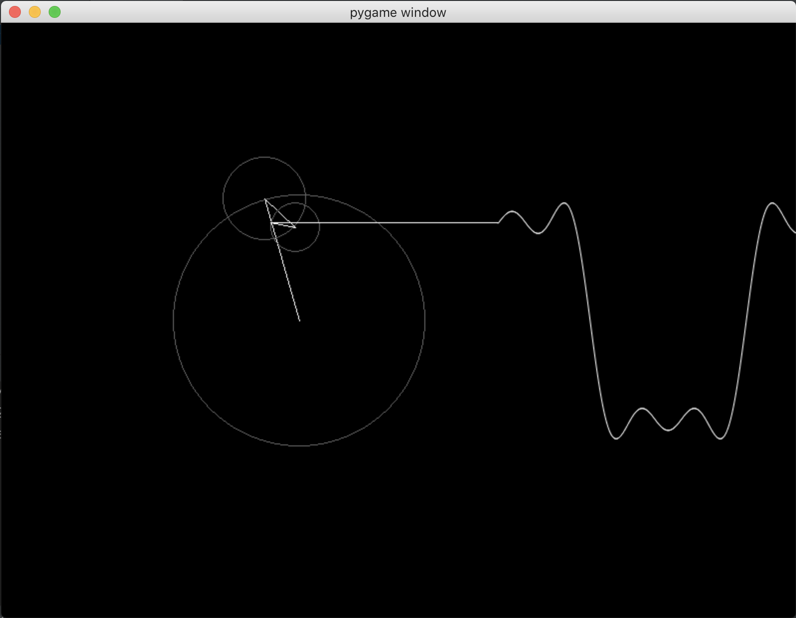

# Description

This is a transcription of the Coding Challenge #125: Fourier Series of "The Coding Train".

Here's a link to the video: [Coding Challenge #125: Fourier Series](https://www.youtube.com/watch?v=Mm2eYfj0SgA)

Screenshot of the result:

# How to run this code:

1. Install pipenv.
2. Run pipenv to install the dependencies.
3. Execute: `python main.py`

If you don't know how to use pipenv, click [here](https://pypi.org/project/pipenv/)

Note: this code was written using Python 3.9, but it can be adapted easily to any other version.
